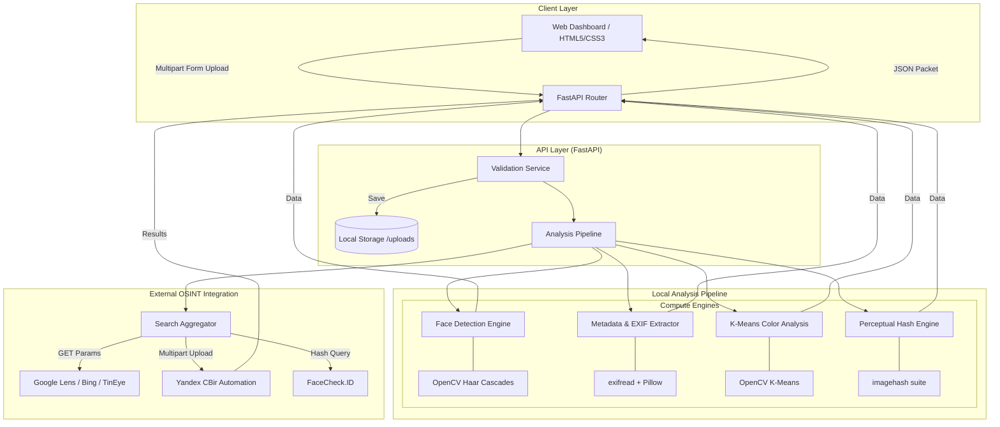

# 🔍 ImageFinder — Reverse Image Search & Face Finder

Upload any photo to detect faces, extract metadata, generate image fingerprints, and search across 8+ search engines worldwide. **No API keys required.**

## Features

- **👤 Face Detection** — OpenCV-powered multi-pass face detection (frontal + profile)
- **📷 EXIF Extraction** — Camera model, date, GPS coordinates, lens info
- **🎨 Color Analysis** — Dominant color palette via K-means clustering
- **🔑 Image Fingerprinting** — 5 perceptual hash algorithms for duplicate detection
- **🌐 8 Search Engines** — Google Lens, Yandex, Bing, TinEye, PimEyes, FaceCheck, and more
- **⚡ Auto Yandex Search** — Automated reverse image search via Yandex's public CBir API
- **🎯 Zero API Keys** — Everything runs locally, no external API keys needed

## Quick Start

```bash
# Install dependencies
pip install -r requirements.txt

# Run the server
python main.py

# Open in browser
# http://127.0.0.1:8000
```

## 🏗️ System Architecture

ImageFinder utilizes a modern, micro-service oriented modular architecture to achieve fast local processing and automated global search delivery.

### 📊 Architectural Workflow


### ⚙️ Component Breakdown

1.  **The Web Dashboard (Frontend)**: A state-of-the-art dark mode glassmorphism SPA built using vanilla technologies. It efficiently pipelines binary image data via the Fetch API and streams dynamic results directly into DOM components for zero-latency UX.
2.  **The Core Router (FastAPI Backend)**: Asynchronous gateway orchestrating analysis workers. Highly efficient asynchronous IO for multiple concurrent uploads.
3.  **Local Analysis Engines**:
    *   **Face Detector**: Dual-stage OpenCV detector utilizing `haarcascade_frontalface_default` and `haarcascade_profileface`. Performs Intersection-over-Union (IoU) filtering and base64 thumbnail generation for identified crops.
    *   **EXIF Processor**: Leverages binary-stream extraction via `exifread` providing GPS coordinate lookup mapping direct to Google Maps.
    *   **Color Clusterer**: Vectorizes pixel matrices, transforming RGB space into cluster centers using iterative K-Means solvers.
    *   **Hash Generator**: Generates unique digital distinct fingerprint utilizing Average Hashing, Difference Hashing, and Perceptual Hashing to permit robust, rotation/scaling agnostic image matching.
4.  **OSINT Aggregator**: Converts local binary payloads into HTTP-ready multipart objects targeting proprietary global visual search indexers (Yandex, TinEye) bypassing fixed limits.

## Tech Stack

| Component | Technology | Purpose |
|-----------|-----------|----------|
| **Core Stack** | Python 3.9+, FastAPI, Uvicorn | High-perf API routing |
| **Detection** | OpenCV (`cv2`) | Computer Vision cascades |
| **Imaging** | Pillow (`PIL`), NumPy | Matrix handling, resize, formats |
| **Forensics** | `exifread` | GPS and metadata extraction |
| **Intelligence** | `httpx`, `imagehash` | Automated OSINT, fingerprinting |
| **Interface** | HTML5, ES6 JS, Vanilla CSS | High-speed glassmorphism frontend |

## 🚀 Quick Start

```bash
# 1. Clone project
git clone https://github.com/Amit123103/find_people.git
cd find_people

# 2. Install dependencies
pip install -r requirements.txt

# 3. Boot the engine
python main.py

# 4. Open URL
# Navigate to http://127.0.0.1:8000
```

## 📈 How It Works

1. **Upload** — Simply drag-and-drop onto the glassmorphism dropzone.
2. **Vectorization** — Server deserializes the stream into NumPy matrices and handles metadata sanitation.
3. **Analysis Workflow** — Face detection cascade maps locations, hashing engine prints fingerprints, and EXIF is parsed synchronously.
4. **Remote Synthesis** — Automated engines construct external search payloads.
5. **Unified Output** — Front dashboard renders the complete dossier.
